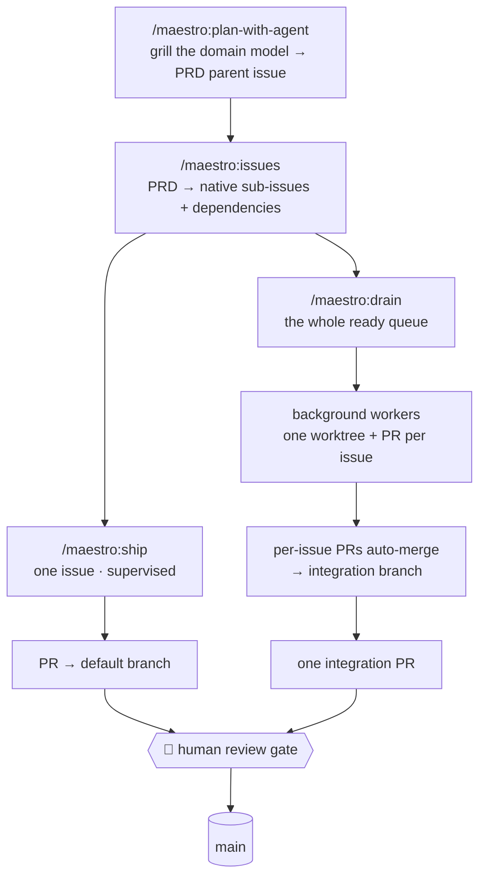
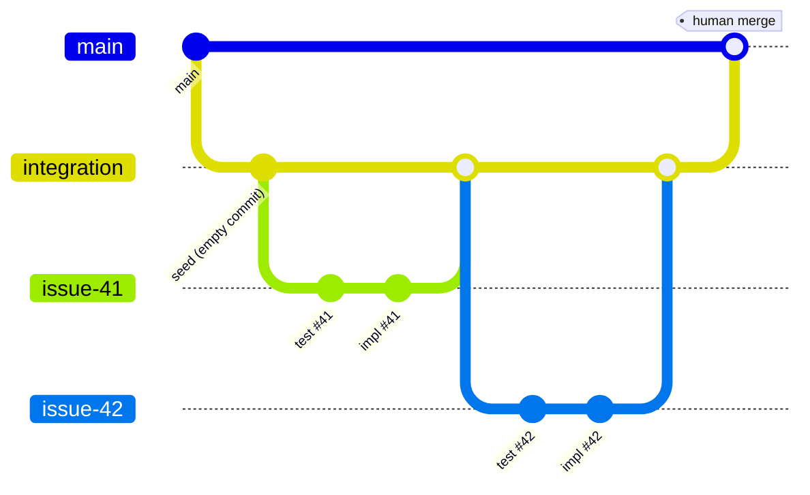

<div align="center">

<h1>🤖 maestro</h1>

<p><b>A downloadable, multi-agent AI maestro for any GitHub repo.</b></p>

<p>
Plan a PRD with the agent → break it into native sub-issues → fan out
<b>background workers, one per issue</b> → land them on an
<b>integration branch</b> behind a single human review gate.
</p>

<p>
  <a href="LICENSE"></a>
  
  <a href="https://docs.claude.com/en/docs/claude-code/overview"></a>
  
  <a href="CONTRIBUTING.md"></a>
</p>

<p>
  <a href="#commands">Commands</a> ·
  <a href="#install">Install</a> ·
  <a href="#integration-branch-model">Integration model</a> ·
  <a href="#whats-inside">What's inside</a> ·
  <a href="#safety">Safety</a> ·
  <a href="docs/ARCHITECTURE.md">Architecture</a> ·
  <a href="docs/GLOSSARY.md">Glossary</a>
</p>

</div>

---

This repo is a Claude Code **marketplace** (`maestro`) shipping one **plugin** (`maestro`). It's **self-contained** — it brings the whole workflow (planning, breakdown, strictly test-first implementation, review) plus the autonomous multi-agent orchestration layer, with no external skill dependencies.



## Commands

| Command | What it does |
|---|---|
| `/maestro:init` | One-time setup: labels, `.maestro/` runtime, PR template — **and** a short discussion that writes your project context into `CLAUDE.md`, `AGENTS.md`, `.claude/rules/maestro.md`, `docs/GLOSSARY.md`. |
| `/maestro:plan-with-agent` | Grill a feature against the domain model (updating `CONTEXT.md` + ADRs), then publish a **PRD** as a parent issue. |
| `/maestro:issues <prd#>` | Break the PRD into **sub-issues** with **native dependencies**, labelled `maestro:ready-for-agent`, assigned to you. |
| `/maestro:ship <issue#>` | Implement **one** issue (supervised) — a background worker opens a PR to the default branch; awaits your review. |
| `/maestro:drain` | Implement **all** your ready issues in **dependency order** on an **integration branch**; each per-issue PR auto-merges into it; the integration PR is your one review gate. |
| `/maestro:auto` | Autonomous loop: `maestro:roadmap` → `drain`, repeatedly. Issues it creates are labelled `maestro:auto` and skip the human `maestro:ready-for-agent` gate. |
| `/maestro:roadmap` | Analyze what's already shipped → propose next features + tech-debt → create issues under a roadmap parent + milestone. |
| `/maestro:code-feedback [pr#]` | Review a PR (inline GitHub review) or the whole codebase (report + optional `maestro:ready-for-agent` `maestro:tech-debt` issues). Asks you for scope + focus. |
| `/maestro:code-architecture-map` | Map the codebase (modules, seams, dependencies) → `docs/architecture-map.md` + optional HTML report. |
| `/maestro:status [close-integrated]` | The pipeline board; or close out a merged integration run. |

The coordinator commands (`ship`, `drain`, `maestro:auto`) **only coordinate** — they dispatch **background** `issue-implementer` workers and stay responsive, so **you can keep participating** in the same session.

## Install

```bash
claude plugin marketplace add neelneelpurk/maestro     # or: add ./  (local checkout)
claude plugin install maestro@maestro
# RESTART Claude Code (or /reload-plugins) — required so the issue-implementer
# agent type and /maestro:* commands load (the agent registry is fixed at session start)
/maestro:init                                             # set up the repo you want to drive
```

> The marketplace is `maestro`; the plugin is `maestro` — hence `/maestro:*` and the install target `maestro@maestro`.

### Prerequisites
- [`gh`](https://cli.github.com/) authenticated with `repo` scope, and `jq`.
- That's all — the plugin is self-contained (no external skill dependencies).

## Integration-branch model

A run is fully autonomous below the default branch, with one human gate at it:

- `drain`/`maestro:auto` open **one integration branch** off the default branch and **one integration PR** (integration → default). That PR is **never auto-merged** — it is your single review gate, and it collects a running checklist of integrated issues.
- Each issue gets its own branch (created with `gh issue develop`, natively linked) off the integration branch; its **per-issue PR targets the integration branch and is merged automatically once the quality gate is green**. Dependents build on already-integrated work, so the dependency queue self-progresses.
- Issues are **never auto-closed** — they move to `maestro:waiting-for-human-closure`. When you merge the integration PR, run `/maestro:status close-integrated` to close them.



`/maestro:ship` is the simpler supervised path: one issue, a PR straight to the default branch with `Closes #n`, awaiting your review.

See [docs/GLOSSARY.md](docs/GLOSSARY.md) for the full label state machine and [docs/ARCHITECTURE.md](docs/ARCHITECTURE.md) for the design.

## What's inside

| Block | Where | What |
|---|---|---|
| **Scripts** | `plugins/maestro/scripts/` | bash + `gh` + `jq`: native sub-issues/dependencies, `gh issue develop` links, worktrees, the integration run, quality gate, queue queries |
| **Subagents** | `plugins/maestro/agents/` | `issue-implementer` — dispatched in the **background**, one per issue |
| **Skills** | `plugins/maestro/skills/` | `plan-with-agent`, `ship`, `drain`, `maestro:auto`, `maestro:roadmap`, `code-feedback`, `code-architecture-map`, `implement-issue` |
| **Hooks** | `plugins/maestro/hooks/` | PR quality-gate backstop + AI-disclaimer guard (PreToolUse) |
| **Rules** | seeded into the repo | `.claude/rules/maestro.md` + `CLAUDE.md` — **inherited by every worker**, even inside worktrees |
| **Loops** | `/maestro:drain`, `/maestro:auto` | self-paced via background-worker completion + `/loop` / `ScheduleWakeup` |

## Safety
- **You are the merge gate** — the integration PR is never auto-merged; `ship` PRs await your review.
- **No red PRs** — the quality gate runs before any PR opens (and a PreToolUse hook backstops manual `gh pr create`).
- **No auto-close** — issues move to `maestro:waiting-for-human-closure`; you close them when you merge the integration PR.
- **Isolation** — one git worktree + branch per issue; concurrency capped by `MAESTRO_MAX_PARALLEL`.

## Further reading
- [docs/ARCHITECTURE.md](docs/ARCHITECTURE.md) — the full design (coordinator + background workers, the GitHub-native data model).
- [docs/GLOSSARY.md](docs/GLOSSARY.md) — labels and the complete state machine.
- [docs/TESTING.md](docs/TESTING.md) — the quality gate and how to run it locally.
- [CONTRIBUTING.md](CONTRIBUTING.md) — project layout and pull-request conventions.
- [blog/one-human-gate.md](blog/one-human-gate.md) — the story behind the design.

## License
MIT — see [LICENSE](LICENSE). Self-contained: no external skill dependencies.
