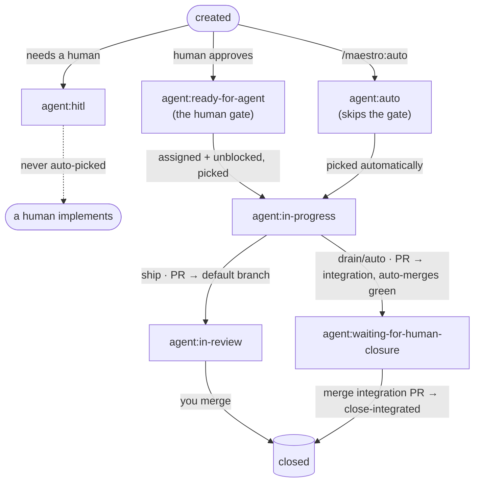

# maestro glossary

The vocabulary, labels, and state machine of the pipeline. Generated by
`/maestro:init`; the conventions in `.claude/rules/maestro.md` reference it.

## Branches & PRs

- **Default branch** (`main`/`master`) — the trunk. Only ever updated by a human merging an integration PR (or a `ship` PR).
- **Integration branch** (`maestro/integration-<stamp>`) — a per-run branch off the default branch where `drain`/`auto` land each issue. Created by `integration.sh start`.
- **Issue branch** (`maestro/issue-<n>-<slug>`) — one per issue, created with `gh issue develop` so GitHub records a native branch↔issue link. Branches off the integration branch (drain/auto) or the default branch (ship).
- **Integration PR** — integration branch → default branch. The **single human review gate**; never auto-merged. Titled `Integration (@<driving-login>): <goal or "ready queue">` and assigned to that person, so concurrent runs from different teammates stay distinguishable. Accumulates a progress comment + checklist of integrated issues (rebuilt from the run log each time, so concurrent workers can't clobber each other's entries).
- **Per-issue PR** — issue branch → integration branch; auto-merged once green.
- **Ship PR** — issue branch → default branch, with `Closes #<n>`; awaits human review.

## Labels

### Type
| Label | Meaning |
|---|---|
| `agent:prd` | A PRD / epic parent issue. |
| `agent:roadmap` | A roadmap parent issue. |
| `agent:bug` / `agent:enhancement` | Category. |
| `agent:tech-debt` | Technical debt to pay down. |

### Gate / mode
| Label | Meaning |
|---|---|
| `agent:ready-for-agent` | Human-approved for autonomous implementation (the human gate). |
| `agent:auto` | Autonomous lane — created by `/maestro:auto`; **skips the `agent:ready-for-agent` gate**; picked automatically. |
| `agent:hitl` | Needs a human; never auto-picked. |

### Execution state (one at a time)
| Label | Meaning |
|---|---|
| `agent:in-progress` | A worker is implementing it. |
| `agent:in-review` | `ship`: a PR to the default branch is open, awaiting your review. |
| `agent:waiting-for-human-closure` | `drain`/`auto`: the work is merged into the integration branch; the issue stays open until you merge the integration PR and close it. |
| `agent:blocked` | Board marker: has open dependencies. |

### PR
| Label | Meaning |
|---|---|
| `agent:integration` | The integration → default-branch PR (your review gate). |

## State machine

## Dependencies

Modeled with **native GitHub issue dependencies** (`blocked_by`). A blocker is
considered cleared once it is **closed** or labelled `agent:waiting-for-human-closure`
(its work is already in the integration branch) — which is what lets the drain
queue advance without auto-closing issues.
